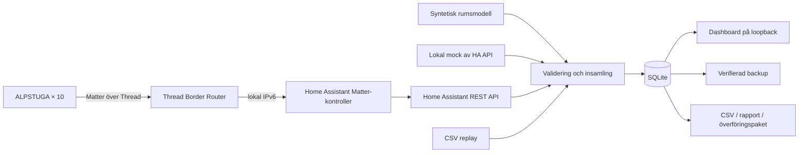

# Systemdesign

## Kedjan



Varje placering har **en aktiv provider**. Inget HA-fel slår över till
simulering. Historiska källor är kvar som egna serier. Demo, pilot och production
har separata databaser med en beständig lägesmarkering.

En Thread Border Router transporterar IP-paketen; den är inte automatiskt vår
loggare eller Matter-kontroller. Apple TV/HomePod kan fylla transportrollen.
ZBT-2 behöver värddator och OpenThread Border Router. Vi återanvänder en riktig
Matter-stack för parning, kryptering, certifikat och återanslutning.
[Home Assistant Matter](https://www.home-assistant.io/integrations/matter/)

## Val av programvara

| Del | Val | Motiv |
|---|---|---|
| Logger | Python 3.11+ standardbibliotek | Få installationssteg; portabel till Linux; granskningsbar kod |
| Databas | SQLite, WAL, synchronous FULL | Transaktioner, lokal fil, online-backup; rimlig skala för 10 punkter |
| UI | Lokal HTML/CSS/JS och SVG | Inga paket, CDN:er, externa teckensnitt eller konton |
| Radio/protokoll | Home Assistant + officiell Matter-stack | Återanvänd säkerhetskritisk och komplex protokollkod |
| HA:s långtidshistorik | Inte primär databas | Loggerns schema, källor och backup kan användas oberoende av HA:s recorder-retention |
| Grafana/InfluxDB/MQTT | Inte nödvändiga för M1 | Skulle ge fler processer och beroenden än tio punkter kräver |

Den egna dashboarden ger det efterfrågade resultatet. Om målorganisationen har
Grafana kan en godkänd mottagare importera CSV/överföringspaket till en central
SQL-databas och Grafana ansluta dit. Vi inför inte en extern SQLite-plugin för
Grafana eller exponerar loggerns databas över nätverket.

## Datakontrakt

En rad representerar en storhet från en placering och källa:

```text
sensor, metric, source, ts, value, received_at, config_hash, timestamp_kind
```

- `sensor`: stabilt placerings-id, till exempel `sw-3a`. Rummet finns i versionerad konfiguration.
- `metric`: `temperature` i °C eller `co2` i ppm. Inkommande HA-enhet måste matcha.
- `source`: `simulation`, `ha`, `matter`, `mock` eller `replay`.
- `ts`: UTC Unix-sekunder. För HA är detta rapport-/uppdateringstid, inte garanterat sensorns interna mättid.
- `received_at`: mottagningstid i UTC, oberoende av mättid/rapporttid.
- `config_hash`: SHA-256 av konfigurationen; hela konfigurationsversionen bevaras.
- `timestamp_kind`: `model`, `ha_last_reported`, `ha_last_updated`, `matter_read_received` eller `imported`.

Primärnyckeln `(sensor, metric, source, ts)` gör omleverans idempotent. Första
värdet för en nyckel behålls. Precisionen är en sekund, vilket passar denna
minutupplösning men inte en högfrekvent sensor. Ingen omkalibrering skriver om
gamla råvärden. Vid fysisk flytt ska en ny placering användas om mätningen inte
är jämförbar; metadatahash ensam skiljer inte statistikrader åt.

HA-adaptern läser `/api/states` med Bearer-token. Den föredrar `last_reported`
och använder annars uttryckligen märkt `last_updated`; den använder inte
`last_changed`. Oförändrade tillstånd ska inte dupliceras med ny polltid.
`unavailable`, `unknown`, saknade enheter, NaN, fel enhet, framtida eller för gamla
tidsstämplar ger lucka och hälsostatus. Varje giltig storhet lagras även om den
andra storheten saknas. [HA REST](https://developers.home-assistant.io/docs/api/rest/)

Polling kan missa snabba förändringar och hämtar inte historik efter avbrott.
En HA-rapport är inte ett kryptografiskt bevis på en färsk fysisk mätning. M3
måste kontrollera verklig cadence och beteende vid radiobortfall. Om det behövs
ska vi därefter använda händelseström eller separat historikimport.

## Analys och luckor

Varje värde antas gälla till nästa rapport, dock högst `max_hold_seconds`:
180 s i demo, preliminärt 600 s i office. Sedan börjar en lucka. Detta är ett
**uttryckligt sample-and-hold-antagande**, inte interpolation av obegränsad längd.
Åldersgränsen behöver verifieras på ALPSTUGA före skarpa slutsatser.

Medelvärde, P95 och tid över/under referens viktas med observerade sekunder.
P95-histogrammet avrundas till 0,01 °C respektive 1 ppm; rådata avrundas inte av
loggern. Täckning = observerade sekunder / förväntade sekunder i valt urval.
Tomt urval ger inget värde, inte noll. Varje källa får egen statistik. Täckning
mäter färskt rapporterat underlag, inte antal fysiska sensormätningar.

Arbetstid är måndag–fredag 08–17 i Europe/Stockholm. Lokal kalender hanterar
sommar-/vintertid. Helgdagar, verklig beläggning och skiftarbete ingår inte;
`work_hours` kan ändras och filtret kan stängas av. Upplevelser lagras separat
och innehåller inga obligatoriska personfält.

Grafen begränsas till ungefär 480 tidsintervall per serie och visar tidsviktat
medel. Envald punkt visar även min–max. Helt tomma intervall bryter linjen;
kortare luckor kan ligga inuti ett aggregerat intervall och syns då i dess
underlag/täckning. Zooma in för bortfallsanalys. Rapportens extrema kommer från
råvärden och döljs inte av grafens medelbildning.

## Lagring och drift

10 punkter × 2 storheter × 1 rad/minut ger högst **10 512 000 rader/år**.
M1:s 28 dagar gav ungefär 134 MB för 805 000 rader på denna dator, cirka 1,8 GB/år
med samma schema och datamönster. Det är en extrapolering, inte en garanterad
filstorlek. WAL, fria sidor, konfigurationsbyten och säkerhetskopior tillkommer.
128 GB räcker gott för en pilot; kontrollera förbrukningen efter en riktig månad.

Transaktioner och WAL ger samtidiga läsare och skrivare. En fillåsning förhindrar
två kontinuerliga insamlare mot samma databas. Väggklocka ger tidsstämplar och
bakåtjusterad klocka pausar insamlingen tills tiden hunnit ifatt. Omslag/sömn
skapar en lucka. NTP behöver vara korrekt innan verklig insamling startas.

Rådata raderas inte automatiskt. Automatiska dagsbackuper behåller de senaste
sju **markerade, egengenererade** kopiorna efter att en ny kopia verifierats.
Manuella backuper skrivs varken över eller raderas. SD-kortet är en gemensam
felpunkt: minst veckovis verifierad kopia ska därför föras till annan lagring.
Planera gärna USB-SSD för längre skarp drift och bra strömförsörjning.

Dashboarden startas bara på 127.0.0.1. HA OS-appen är helt utan lyssnande port
och producerar dagliga kopior för laptopvyn. Den egna servern är avsedd för en
lokal användare via dator/SSH-tunnel, inte som fleranvändartjänst på ett nätverk.

## Direkt Matter-insamling

Logger 0.2 kan också läsa den fristående lokala Matter-servern. Schema 2
tillåter källan `matter` och uppgraderar schema 1 transaktionellt. Node.js 24
ger WebSocket-transporten; Python validerar svaren. `matter_read_received`
avser mottaget fjärrlässvar, inte givarnas interna mättid. Initial cache används
inte för insamling. Se [Matter-adaptern](MATTER-COLLECTION.md).
