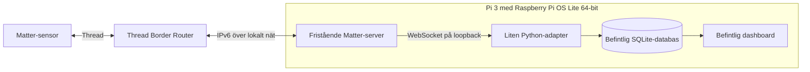

# Förstudie: Kebnekaise utan Home Assistant

Förstudien bedömer en äldre Raspberry Pi med begränsat RAM som möjlig för en
logger, men inte som ett bevis på produktionskapacitet. Exakt hårdvara och
provresultat hör till den lokala installationens verifieringsanteckningar.

**Rekommendation:** prova en fristående Matter-server och en liten adapter till
vår logger innan ny dator köps. Home Assistant är ett integrationsval i dagens
kod, inte ett krav från Matter. Förstudien omfattar källkodsgranskning och ett
lokalt start-/API-prov. Se [Pi-guiden](PI-SETUP.md) och
[avläsningsmetoden](MATTER-COLLECTION.md); konkreta hårdvaru- och
driftresultat ska sparas lokalt.

## Vad vi kan återanvända

Home Assistant Core är öppen källkod under Apache 2.0. Dess Matter-integration
använder ett separat klientbibliotek och en separat Matter-server. Servern har
ett publikt WebSocket-API och är avsedd att kunna användas även av andra projekt.
Vi behöver därför inte kopiera loss Home Assistants komponent- och entitetssystem.
[Core-licens](https://github.com/home-assistant/core/blob/dev/LICENSE.md),
[Matter-manifest](https://github.com/home-assistant/core/blob/dev/homeassistant/components/matter/manifest.json),
[Matter-server](https://github.com/matter-js/matterjs-server).

Matter.js och Matter-serverns källkod har också Apache 2.0-licens. Biblioteken kan
återanvändas enligt licensvillkoren; vid distribution behöver relevanta licens-
och upphovsrättsnotiser följa med. Detta är komponenternas licenser, inte ett
påstående om att samtliga paket i Home Assistant OS har samma licens.
[Matter.js-licens](https://github.com/matter-js/matter.js/blob/main/LICENSE),
[serverlicens](https://github.com/matter-js/matterjs-server/blob/main/LICENSE).

## Föreslagen kedja

Med en kompatibel Apple TV/HomePod kan border routern ligga där. Med USB-radio
behövs också OpenThread Border Router, på Pi:n eller annan värd. Home Assistant
är inte ett krav för OTBR, men installationen blir ytterligare ett moment.
[Matter.js om Thread](https://github.com/matter-js/matter.js/blob/main/docs/USAGE_THREAD.md),
[OTBR](https://openthread.io/guides/border-router).

Om sensorn först ansluts till Apple Home kan vår fristående kontroller läggas
till via Matters delningsflöde. Då är sensorn redan ansluten till Thread och
Pi:n kan para över IP med den nya delningskoden. Det är inte den ursprungliga
etikettkoden som automatiskt öppnar en ny parningsmöjlighet. Alternativet med
egen USB-radio kräver Thread-konfiguration och initial parning, normalt via BLE.
Vilket flöde som fungerar med den aktuella sensorn ska provas i målmiljön.
[Matter-delning](https://www.home-assistant.io/integrations/matter/#sharing-a-device-from-another-platform-with-home-assistant).

## Vad källkoden visar

- Home Assistants `sensor.py` läser standardattributet
  `TemperatureMeasurement.MeasuredValue` och dividerar med 100 för °C.
- CO₂ kommer från `CarbonDioxideConcentrationMeasurement.MeasuredValue`.
  Vår direkta adapter ska dessutom kontrollera `MeasurementUnit`, inte anta
  att alla koncentrationsvärden är ppm. Matter.js anger `Ppm = 0`.
- Endpoint-id måste identifieras på den verkliga sensorn. Det får inte antas
  vara samma för båda storheterna eller mellan olika firmwareversioner.
- Serverns API har `commission_with_code`, `get_nodes`, `start_listening`
  och `read_attribute`. Vi behöver ett litet urval av API:t.
- `get_nodes` och den initiala dumpen innehåller cachevärden utan en separat
  mättid per attribut. Att lagra dem med ny polltid kan därför ge falsk färskhet.
- I den installerade servern 1.4.0 använder `read_attribute` en fjärrläsning via
  `node.node.interaction.read` med `includeKnownVersions: true`. Bibliotekets
  kod beskriver detta som att även oförändrade versioner ska returneras.
  Det är en lämplig utgångspunkt för vår minutinsamling. Praktiskt beteende vid
  oförändrade värden och radiobortfall återstår att verifiera.

Källor: [HA:s sensorkod](https://github.com/home-assistant/core/blob/dev/homeassistant/components/matter/sensor.py),
[serverns kommandon](https://github.com/matter-js/matterjs-server/blob/main/packages/ws-controller/src/controller/ControllerCommandHandler.ts),
[API-hanterare](https://github.com/matter-js/matterjs-server/blob/main/packages/ws-controller/src/server/WebSocketControllerHandler.ts),
[fjärrläsning](https://github.com/matter-js/matter.js/blob/main/packages/node/src/node/client/ClientNodeInteraction.ts).

En lyckad fjärrläsning bevisar att sensorn svarade med ett värde. Den bevisar
inte att sensorns interna givare gjorde en ny fysisk mätning just då. Vi bör
märka tiden som mottagnings-/avläsningstid, exempelvis `matter_read_received`,
och behålla den skillnaden i datamodellen.

## Lokalt prov och dess begränsning

Ett isolerat prov gjordes med publicerade, exakt valda paket:

| Del | Version / villkor |
|---|---|
| Matter-server | npm `matter-server@1.4.0` |
| Matter.js | `0.17.9` |
| Node.js | `24.19.0` |
| Värd | Lokal utvecklingsmaskin; dokumenteras inte i repo |
| Varaktighet | Tidsbegränsat lokalt prov |
| Enheter | Ingen fysisk sensor användes i provet |
| API | Loopback; porten väljs lokalt |
| mDNS | Begränsat till lokal testmiljö |
| Avstängt i provet | dashboard, OTA och Thread-diagnostik |

Servern startade, gav serverinformation med API-schema 13, accepterade
`start_listening` med en tom enhetslista och returnerade felkod 5 vid en
avläsning av ett obefintligt node-id. Avslut med SIGTERM gav exitkod 0.

Provet visade att servern startar och svarar på API-anrop i en tom lokal
controller. Minnesprofilen var tillräckligt intressant för att motivera ett
Pi-försök, men detta är **inte ett Pi-prestandatest, inte ett test med tio
sensorer och inte en mätning av hela lösningens minne**. Python, OS, databas-
frågor och eventuell OTBR tillkommer. Spara exakta mätvärden lokalt om de
behövs för ett hårdvarubeslut.

Råresultat och provkod från lokala feasibility-prov ska ligga i Git-ignorerad
lokal lagring. Provet är avsiktligt låst till en tom controller; det är ingen
installationsanvisning för sensorerna eller Pi:n. Paket hämtas med
installationsskript avstängda och servern körs inte som systemtjänst i detta
utvecklingsprov.

**Bedömning:** minnesresultatet motiverar ett kontrollerat försök på en Pi med
begränsat RAM. Det motiverar inte ett löfte om stabil skarp drift. Lagring,
backupvolym och skrivslitage behöver följas i målmiljön.

## Hur mycket behöver vi implementera?

| Väg | Eget arbete | Bedömning för Kebnekaise |
|---|---|---|
| Home Assistant OS + Matter | Entity-mappning och installation; dagens adapter återanvänds | Enklast som färdig helhet, men fler delar än vårt ändamål kräver. HA rekommenderar Pi 4/5 med minst 2 GB. |
| Fristående Matter-server + Python-adapter | Konfiguration, avläsning, tidsmärkning, återanslutning och drift | Förstahandsval för nästa prototyp. Vi återanvänder serverns protokoll- och parningshantering. |
| Egen liten tjänst direkt på Matter.js | Även controllerns livscykel, parningsverktyg och fler bibliotekskopplingar | Möjligt, men gör först om servern visar sig vara för tung eller otillräcklig. Besparingen är inte uppmätt. |
| Implementera Matter-protokollet från grunden | Säkerhet, certifikat, sessioner, upptäckt, kodning, återförsök, prenumerationer m.m. | Ett betydligt större projekt än vår logger; inte ett rimligt sätt att spara några tjänster. |

De tre senare bedömningarna är vår tekniska slutsats. HA:s rekommendation finns
i [installationsguiden](https://www.home-assistant.io/installation/raspberrypi/).
Matter.js har [controller-exempel](https://github.com/matter-js/matter.js/tree/main/examples/controller),
men just det exemplet är uttryckligen utvecklingskod med API som kan ändras.
Det ska inte lyftas in oförändrat som vår drifttjänst.

För den fristående servern behöver vi konkret:

1. Lägga till en `matter`-källa och mappning mellan placering, node-id och
   identifierade endpoints. Berör konfiguration, källval i UI, databasens
   källkontroll, export och testfall. Gamla HA-data ska fortsätta heta `ha`.
2. Ansluta till serverns lokala WebSocket, göra tidsbegränsade avläsningar av
   temperatur och CO₂, validera svar och lagra med korrekt tidssemantik.
   Misslyckad eller delvis lyckad läsning får inte ersättas av cache eller demo.
3. Återansluta efter server-/sensortapp och bevara luckor. Färska oförändrade
   värden måste fungera, och gammal initial cache får inte bli ny historik.
4. Ordna parning och en liten inventering av noder/endpoints. Det kan vara
   ett engångsverktyg; det behöver inte bli en full smarthemspanel.
5. Låsa versioner och köra server + logger under systemd. Serverns styr-API
   hålls på loopback. Ingen Docker eller HA OS krävs för npm-installationen.
6. Säkerhetskopiera även controllerns identitet/nycklar, separat från
   mätningarna. Använd ett verifierat konsistent flöde; en SQLite-backup
   ensam gör inte att parade sensorer kan återanslutas efter kortbyte.

Servern behöver Node.js >=22.13 enligt paketmetadata; Node 24 användes här.
Det historiska provet ovan körde 24.19.0. Driftprofilen är nu låst till 24.21.0
och kräver en vanlig gransknings- och test-PR för varje runtimebyte.
Om vi använder upstreams Python-klient behöver just adaptern Python >=3.12
och dess beroenden. Vår befintliga logger behåller sitt nuvarande krav tills
en sådan adapter faktiskt införs.
[Serverpaket](https://github.com/matter-js/matterjs-server/blob/main/packages/matter-server/package.json),
[Python-klient](https://github.com/matter-js/matterjs-server/blob/main/python_client/pyproject.toml).

**Grov arbetsbedömning:** en prototyp med en tillgänglig sensor och fungerande
Thread-nät är arbete i storleksordningen 1–3 arbetsdagar. Därefter behövs
48–72 timmars hårdvarukörning och omstart-/bortfalls-/återställningsprov.
BLE-/Thread-installation och problem i kontorets IPv6/mDNS kan ta ytterligare
tid. Detta är en uppskattning, inte en verifierad tidsplan. Den här förstudien
har inte utfört adapterarbetet.

## Kontroll innan skarp drift

Prova först en Matter-sensor: identifiera verkliga attribut och enheter, läs ett
oförändrat värde flera gånger, bryt sensorströmmen, bryt nätet och starta om
servern. Verifiera luckor och automatisk återkomst. Kör sedan tio sensorer
samtidigt med en längre dashboardfråga och backup, och kontrollera RAM, swap,
CPU, svarstid, täckning och diskrum på den riktiga Pi:n.

Den gamla Python Matter-servern är arkiverad och anger 8.1.2 som sista version.
Nyutvecklingen ligger i Matter.js-servern. Dess README använder fortfarande
beta-märkning trots publicerade versionspaket; den märkningen och kommande
versionsändringar behöver beaktas vid val för kontorsdrift. Vi ska inte välja
en övergiven version enbart för att undvika förändring.
[Python-serverns status](https://github.com/matter-js/python-matter-server),
[nya serverns status](https://github.com/matter-js/matterjs-server).
